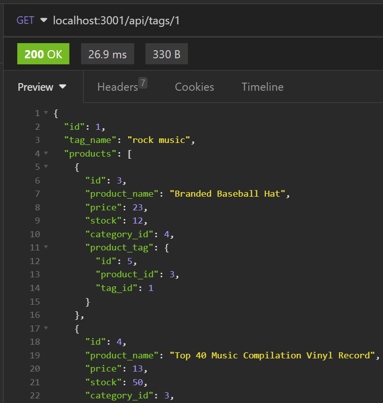
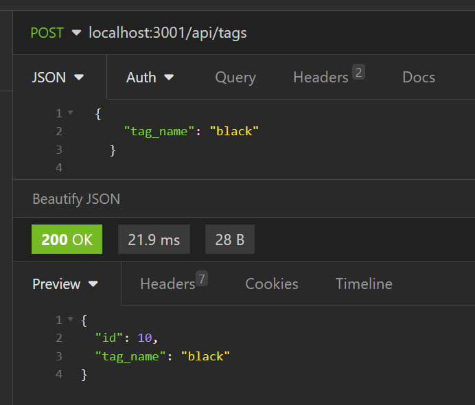
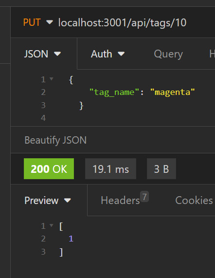
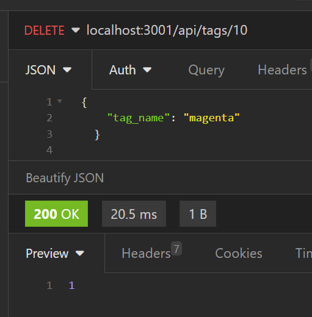

# E-commerce Back End
  
  
  ## Description
 This application built a back-end for an e-commerce site. Uses express.js API with Sequelize to interact with MySQL database using all CRUD operations.

  The application was created using the following criteria:
  - When user enters database name, MySQL username, and MySQL password into environment variable file the user is able to connect to database 
  - When schema and seeds commands entered then a development database is created and seeded with test data
  - When enter node server.js the server is started and Sequelize models are synced to MySQL database 
  - When open API GET routes in Insomnia Core for categories, products, or tags data for routes displayed in JSON
  - WHEN I test API POST, PUT, and DELETE routes in Insomnia Core user is able to successfully create, update, and delete data in database

  ## Table of Contents
- [Installation](#installation)
- [Usage](#usage)
- [License](#license)
- [Contributing](#contributing)
 
## Installation
- In order to use the application node.js will need to be installed.  
Node.js Installation: https://nodejs.org/en/download 

Node Dependencies: 
- Express: Used to create routes for the application 
- MySQL2: Used for housing database and data
- Sequelize: ORM used for creating table models
- Dotenv: Used to store sensitive information

## Usage
To use the application copy code to local computer. In the command line login to MySQL and run source db/schema.sql to create the database if doesn’t exist. Then exit out of MySQL and run node server.js to create the tables with the models defined using sequelize. Exit out of the running port. Then run npm run seed to enter test data into the database. Re-run node server.js to open the port again for testing.  
Use an API development platform to test the routes. For this project I used Insomnia to test routes. Type in the correct route for any get request to see the data for that route. To create value for a route make sure to have all the new variables in json format to send. To update and delete data ensure you specify  an id in the route.
  
Reading All Tags From Specific Id: 
 
Creating a New Tag: 
 
Updating Tag: 
 
Deleting Tag: 
 

## License 
MIT License

## Contributing
The following websites were used for reference to create this application: 
https://www.youtube.com/watch?v=HJGWu0cZUe8 
https://sequelize.org/docs/v6/advanced-association-concepts/advanced-many-to-many/

## Walkthrough Video
[Video Demonstration](https://drive.google.com/file/d/1Gr3b5qzcWNTdp2e1F4rOlTOjKyQxo9Tp/view)
